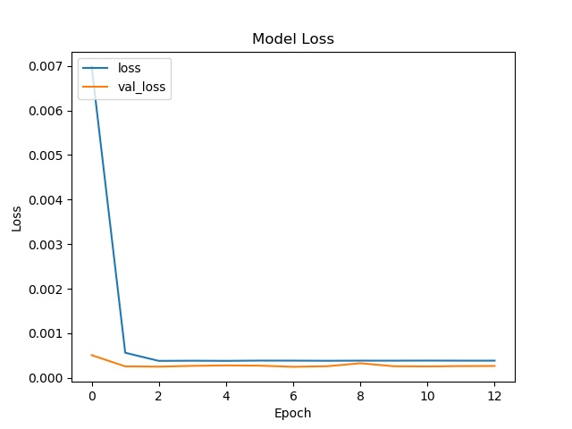

# Pedestrian-Location-Prediction-based-on-YOLOv3
An implementation of my university graduation project.

## Introduction

* We trained an LSTM model to predict the next location of pedestrian to avoid mistake of YOLOv3.
* We recorded more than 100 videos by Google pixel 3

## Results

### Inside testing results(we simulated the yolo mistake)

| Normal | Mistake | Normal |
|-------|-------|-------|
| | | |

### Outside testing results

| Normal | Mistake | Normal |
|-------|-------|-------|
| | | |

### model training results

| LSTM Model | Loss |
|-------|-------|
| | |

## Environment

* Keras
* Python3

## Data

* If anyone who want the data, I can provide.

## How to use

```
wget https://pjreddie.com/media/files/yolov3.weights
python convert.py yolov3.cfg yolov3.weights model_data/yolo.h5
python yolo.py   OR    python yolo_video.py [video_path] [output_path(optional)]
```

## Credits:

[qqwweee/keras-yolo3](https://github.com/qqwweee/keras-yolo3)


